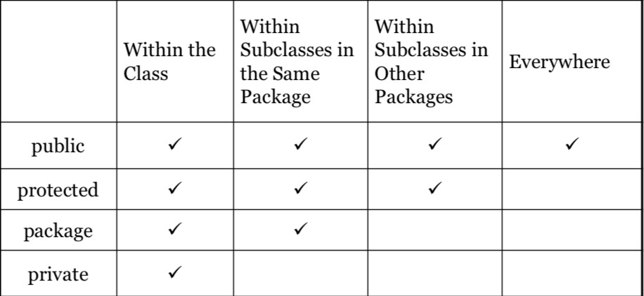

1-29-20
# Lecture 3 - Object-Oriented Programming with Java
#### Object-Oriented Programming
Enables you to develop large-scale software and Graphical User Interfaces (GUI) effectively, through the use of developing reusable software.

## Class and object
A **class** is a blueprint, defining the properties and behaviors of an object.<br>
It is an **Abstact Data Type (ADT)**. Usually represents a mapping to a real world entity.

An **object** is an instance of a class, which means space in memory has been allocated for it.
* The **state** of an object (also known as its properties or attributes) is represented by data fields.
* The **behavior** of an object (its actions)is defined by methods.

`private` methods can only be used by that class, and are also known as *helper methods*.<br>
`public` methods signal to other classes that the method is available to be used.
* Public methods can be used to access and modify data, but those data fields should be made private so that they are only accessible via methods.

 Can add a main method to each class file to serve as a Test Bed.

---

Java Compiler takes Java Source Code and converts it into Java Bytecode.

To compile:
``` 
javac myprogram.java
```
And then to run:
```
java myprogram
```
---
### Constructors
A constructor is a method that defines the protocol for instantiating an object using the `new` operator.
1. A constructor must have the same name as the class itself
2. Constructors do not have a return type -- not even type void.
3. Constructors are invoked using the `new` operator when an object is created. Constructors play the role of initializing objects.

### Accessing Objects
When ever using the dot(.) operator, you are referencing the object's data type.<br>
Also used to access an object's method.

When defining a class, data members have the following default values:
* String:  null
* int:  0
* boolean:  false
* char: '\u0000' [2 bytes, not 1]
* local variables:  null

This is where **NullPointerException** comes into play. 

### Using Java library classes
The **Point2D** class may be useful for creating GUI's.

## Static variables, constants and methods
A static variable is shared by all objects of the class.
* If you want all of the instances of a class to share some data value, use a static variable, also known as a **class variable**.
* Constants in a class that are shared by all objects of that class, should be declared `static final`.

A static method cannot access instance members (i.e., instance data fields and methods) of the class.

An instance method (nonstatic):
* Can invoke an instance method
* Can access an instance data field
* Can invoke a static method
* Can access a static data field


An static method:
* Can **not** invoke an instance method
* Can **not** access an instance data field
* Can invoke a static method
* Can access a static data field

### How to decide if a variable or a method should be static or not?
A variable or method that is not dependent on a single instance of the class should be static.

## Visibility
The default visibility modifier is `package`.<br>
Ideally it is best to use similarly used classes into a single package.



### Data Encapsulation
Making data fields private protects data and makes the class easy to maintain. You can make them accessible with public methods.

Java methods are pass-by-value for primitive types, and also pass-by-value for objects through the object's reference point.

### Immutable Objects and Classes
Even a class with only getters (and no setters) is still **not** immutable because you can alter a class's data with just a reference to the object.

### The `this` keyword
Refers to the object itself.

Using the `this` keyword allows you to use the data field as a paramater name inside a setter method or constructor to make the code easier to read. 

Can also be used to invoke another constructor of the same class.

In the code segment below, the first `this` is used to reference the data field `radius` of the object being constructed. The second `this` is used invoke a previously defined constructor:
```
public class Circle {
    private double radius;
    public Circle(double radius) {
        this.radius = radius;
    }

    public Circle() {
        this(1.0);
    }

    ...
}
```

In the second constructor in this example, Java requires that the `this(arg-list)` statement appear first in the constructor before any other executable statements.

If a class has multiple constructors, it is best to implement them using `this(arg-list)` as much as possible, making the code easier to read and maintain.